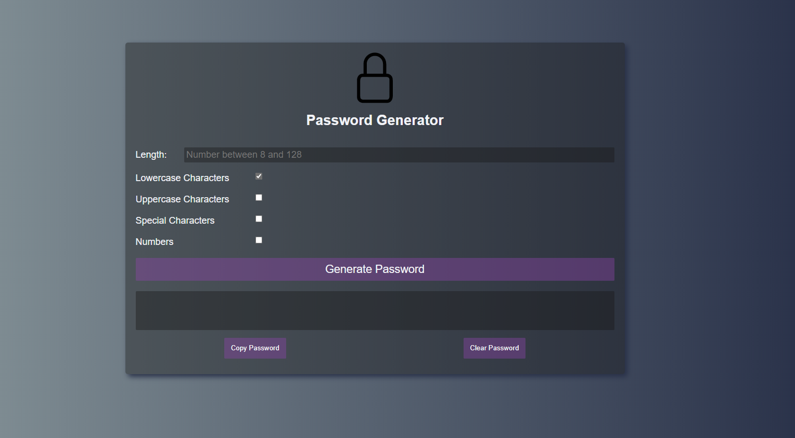

# password-generator
Password generator using javascript. It utilizes the Math.random() function so it is not cryptographically secure.

THe HTML and CSS are responsive to a screen size that is 320 pixels in width or larger due to use of media queries that were heavily inspired from the Bootstrap 4 documentation.

## Usage

There are four types of characters that the user has the option of choosing all or one of and the range of characters has to be between 8 and 128.

https://wbrink.github.io/password-generator/

